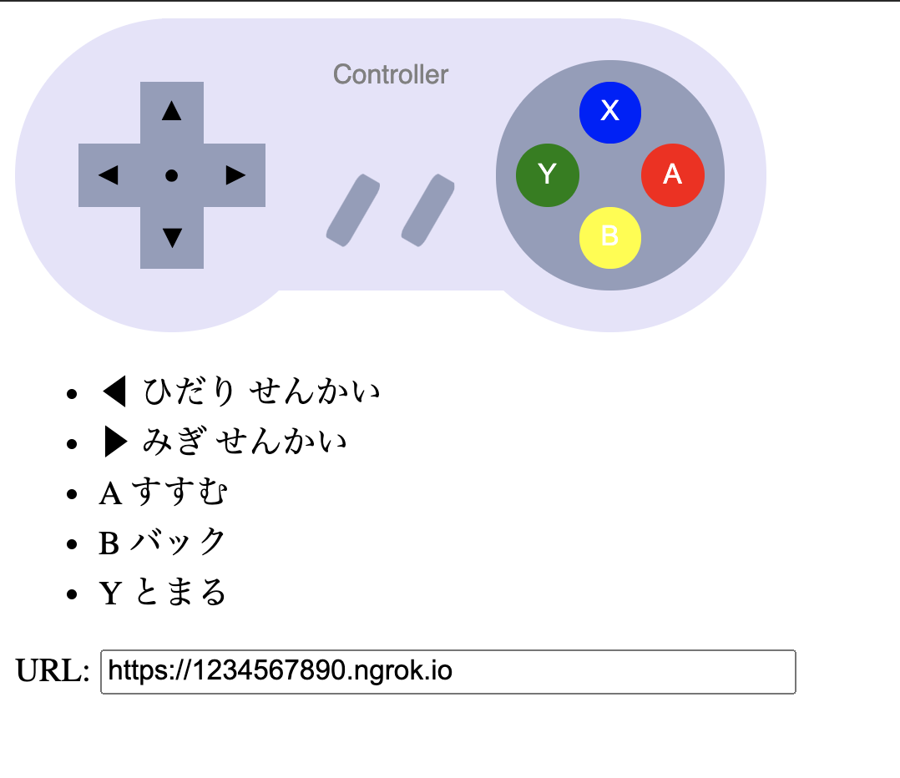
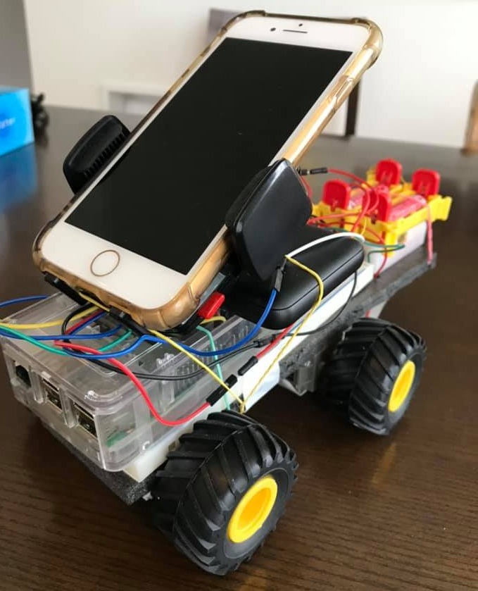
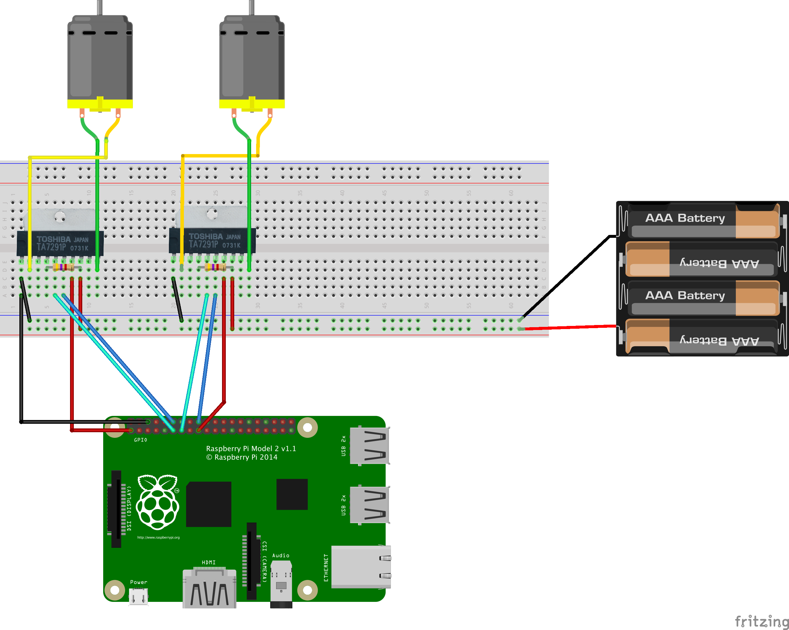

# Zoom Car
A raspberry pi based car that is controllable via http API.

## How to run
### On Raspberry Pi
```
pipenv install
pipenv run start
```
### On Client
Access `index.html` on your web browser. Input raspberry pi endpoint in `URL` field. 


## Reference Implementation
### Hardwares

- Raspberry Pi 2 Model B
- 2x DC Motor
- 2x Motor Driver Toshiba TA7291P
- 2x Resistor 4.7kΩ
- 4x Battery 1.5V
- TAMIYA Double Gearbox + Wheels

### circuit diagram

